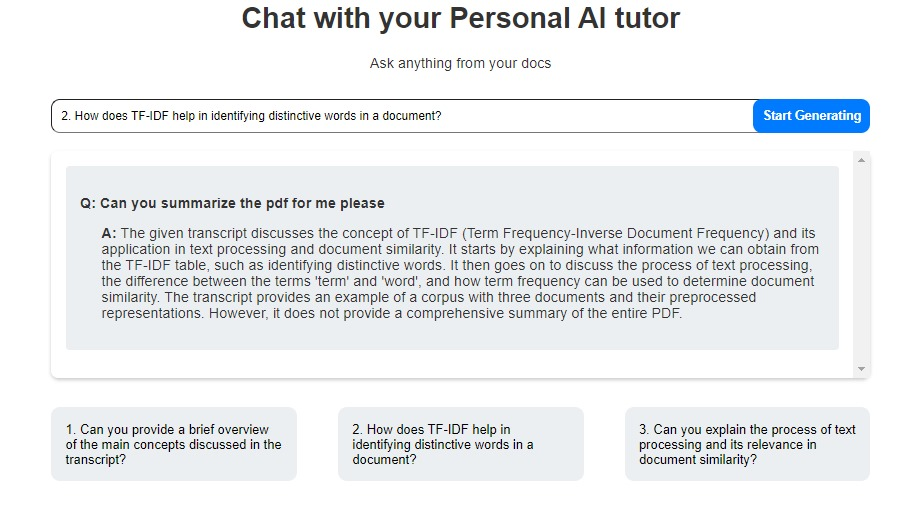

# Personal_tutor

An innovative application designed to streamline last-minute exam preparation and revision. By harnessing the power of AI models, this application offers a range of features to help you prepare for your exams efficiently and effectively.

## Features
**Automatic Generation of Questions:** This application can automatically generate questions based on provided transcripts and source material. These questions are tailored to various difficulty levels to help you prepare for exams of different complexities.

**Upload PDF Files and YouTube Video URLs:** Easily upload PDF files or YouTube video URLs to provide source material for the application. This allows the application to create questions and facilitate discussions based on the content.

**Personal AI Assistant:** Engage in interactive discussions with your personal AI assistant. The assistant can help clarify concepts, answer questions, and guide you through your study materials.

## Getting Started
**1- Download the Application:** Clone or download the repository from the link [here](https://github.com/1aryantyagi/Personal_tutor.git).

**2- Install the Application:** Follow the installation instructions for your operating system.

**3- Launch the Application:** Open LastMinute.ai to begin your exam preparation journey.

**4- Upload Source Material:** Use the interface to upload your PDF files or YouTube video URLs for the application to analyze.

**5- Interact with Your AI Assistant:** Start discussing your study materials with your personal AI assistant.

**6- Use the Automatic Question Generation:** Generate questions based on your source material and select the difficulty level that suits your needs..

